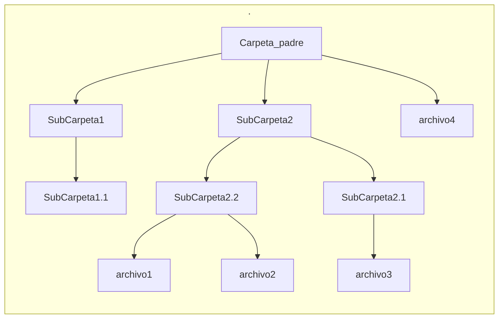

# ContenedorFragmentador
Este programa permite juntar varios archivos en uno unico.

----
## Funcionamiento:

1. Se especifica el directorio(Carpeta) donde se encuentran los archivos  a agrupar. 

2. Una vez se ha situado la carpeta. El programa generar un mapa de la hubicacion de cada archivo. Una vez que se tiene la cantidad de archivo, se guardara en la estructura de datos `MTF`, en el apartado de n_file, el cual es una estructura que almacena un tipo de dato de 16bits sin signo, por lo que, se puede contenet una cantidad de 2**16 archivos. O al menos, es la cantidad que se le puede especificar al programa. Nuestra estructura `MTF` contiene 2 elementos del tipo de estructura `indice` puntero, el primer indice es denominado `start_indices` y es un array dinamico de indices. La segunda estructura se denomina `theend_indices` y al igual que `start_indices`, tambien almacena en nuestro programa los indices de cada archivo mediante un array de indices. 
Nuestro programa genera para cada archivo, dos elementos indices, uno de inicio y otro de final como copia de seguridad, por si se daña el indice de inicio o se ve modificado. Para nuestro programa, los elementos `start_indices[0]` y `theend_indices[0]` hacen referencia al indice de inicio y al indice final del archivo con `ID 0`.

----

- #### Estructura MTF(Master Table File) code y tamaño:

```C
typedef struct MTF
{                           // Master Table File
    _uint16_t n_file;       // numero de archivos contenidos(maximo 65536)
    indice **start_indices;  // indices de inicio
    indice **theend_indices; // indices de final
} MTF;
/*
 * MTF almacena el numero de archivos que se contiene
 * en el contenedor(n_file). start_indices contiene
 * los indices de inicio para los archivos, theend_indices.
 * el indice de inicio del archivo 1 y el indice de final es
 * start_indices[0] y theend_indices[0].
 */
```
|nombre             | Tamaño     |
|:-----------------:|:----------:|
|n_file             |`16 bit`    |
|start_indices      |`indefinido`|
|theend_indices     |`indefinido`|

|  Tamaño total de la estructura          |
|:---------------------------------------:|
|` 16 + ? + ? = minimo 16 Bits = 2Bytes ` |


----

### Estructura indice:

La estructura indice que se contiene en la estructura `MTF`, contiene el nombre del archivo en el campo `name_file`el cual es del tipo `unsigned char`(8bit) y es un array que puede contener nombres de hasta 16 caracteres. Contiene tambien el ID(identificador) del archivo en el campo denominado `id_file`el cual es una estructura de datos que almacena un valor de `16bits`=`2Bytes` que puede ir de `(0-2**16)`. Tambien tenemos un array de punteros dinamicos de sectores, este campo en nuestra estructura `indice` se llama `sectores`.

----

- #### Estructura indice code y tamaño:

```C
typedef struct indice
{
    ui8 name_file[MAX_NAME_BYTES]; 
    /* 
     * nombre del archivo inicial(maximo 16Bytes)
     * MAX_NAME_BYTES = 16
    */
    _uint16_t id_file;    // id del archivo(maximo 65536)
    _uint16_t n_sectores; // numero de sectores del indice(maximo 65536)
    sector **sectores;    // sectores que contiene este indice
} indice;

```
|nombre             | Tamaño                           |
|:-----------------:|:--------------------------------:|
|name_file          |`8 bit * 16 =  128bits = 16Bytes` |
|id_file            |`16 bits = 2Bytes`                |
|theend_indices     |`16 bits = 2Bytes`                |
|sector             |`indefinido`                      |

|  Tamaño total de la estructura                  |
|:-----------------------------------------------:|
|` 128 + 16 + 16 + ? = minimo 160Bits = 20Bytes ` |

----


### Estructura sector:

La estructura sector almacena el ID al que pertenece el mismo en su campo `id_file` que es una estructura de `16bits`. Contiene el inicio del sector en su campo `start_sector` y el final del mismo en su campo `theend_sector`, ambos son estructuras de `16bits`. El campo `theend_sector` contiene unvalor de `16bits` el cual es el resultado de sumar el `start_sector`(inicio del sector) mas el contenido del sector.
`start_sector = 16` y el contenido del sector son `16bytes`.
`theend_sector = start_sector + 16 = 32`.


----

- #### Estructura sector code y tamaño:
```C
typedef struct sector
{
    _uint16_t id_file;       // id del archivo(maximo 65536)
    _uint16_t start_sector;  // direcion de memroia del sector(maximo 65536)
    _uint16_t theend_sector; // final del sector(Maximo 65536)
} sector;
```
|nombre             | Tamaño                           |
|:-----------------:|:--------------------------------:|
|id_file            |`16 bits = 2Bytes`                |
|start_sector       |`16 bits = 2Bytes`                |
|theend_sector      |`16 bits = 2Bytes`                |

|  Tamaño total de la estructura    |
|:---------------------------------:|
|` 16 + 16 + 16 = 48Bits = 6Bytes ` |

----

# code.h y code.c

Estas estructuras mencionadas anteriormente se encuentran definidas en los archivos `code.h` y `code.c`. Tambien situamos definido lo siguiente:

```C
#define MAX_POINT (ui16)0xffff // 65536

#define MAX_NAME_BYTES (ui32)16 // cantidad maxima de bytes como nombre de archivos
#define VERSION (db *)"\x42\x48\x00\x01" // "BH10" = Black Hat 1.0
#define EXTENSION (db *)".bh"
```

- Donde se define la macro `MAX_POINT` como un valor del tipo `unsigned short = uint16_t` de valor `0xffff`.

- Se define la macro `MAX_NAME_BYTES` el cual es un valor del tipo `unsigned int = uint32_t` que almacena el valor maximo para los nombres de archivo + extension que es de `16Bytes`.

- Se define en la macro `VERSION` un conjunto de valores del tipo `unsigned char = uint8_t` el cual se escribe inicialmente en el archivo contenedor e identifica este tipo de archivos, tmb contiene la version del mismo.

- Se define en la macro `EXTENSION` un conjunto de valores del tipo `unsigned char = uint8_t` el cual es la extension de los archivos contenedores.

----
Como funciones encontramos las siguientes:
```C
OutputFile InitFileOutput(ui8 *coments, _uint32_t size);
/*
 * Esta funcion devuelve una estructura del tipo
 * OutputFile que a sido previamente difinida y
 * que contiene punteros de memoria dinamica para arrays.
 * 
 * - coments es un conjunto de valores de tipo 
 * uint8_t donde se puede almacenar informacion
 * extra como comentarios y etc.
 * 
 * - size es una estructura de tipo _uint32_t el cual
 * almacena un valor de tipo uint32_t que especifica
 * el tamaño del parametro coments, si el tamaño se
 * size es menor que el tamaño real de coments, 
 * solo se almacenara la cantidad especificada por size.
 */

void write_MTF(MTF MasterTableFile, OutputFile File);
/*
 * Esta funcion escribe el contenedor final y recibe
 * como parametros una estrutura del tipo MTF llamada
 * MasterTableFile donde se definen una colecion de
 * sectores e indices. Como siguiente parametro recibe
 * una estructura del tipo OutputFile llamada File
 * donde se almacena informacion relacionada al 
 * archivo de salida (archivo contenedor).
 */

void printOutputFile(OutputFile File);
/*
 * Esta funcion recibe como valor una estrutura del
 * tipo OutputFile llamada File para imprimir sus
 * valores en formato hexadecimal.
 * 
 * Imprime los valores de los ID`s de los sectores.
 * El valor del sector de inicio y el del sector final.
 */

void printMTF(MTF MasterTableFiles);
/*
 * Esta funcion recibe como parametro una estructura del 
 * tipo MTF llamada MasterTableFiles para imprinmir sus
 * valores.
 * 
 * Imprime la cantidad de archivos que contiene el 
 * archivo contenedor. He imprime haciendo uso de
 * la funcion printIndice() los indice de inicio y final
 * de cada archivo contenido en el archivo contenedor.
 */

void printIndice(indice _indice);
/*
 * Esta funcion recibe como parametro una estructura del
 * tipo indice llamada _indice para la impresion de
 * sus valores. 
 * 
 * Imprime el valor ID del indice y el numero de sectores
 * que almacenado, ademas imprime los valores de cada
 * sector almacenado en este indice mediante la funcion
 * printSector().
 */

void printSector(sector _sector);
/*
 * Esta funcion recibe como parametro una estructura de
 * tipo sector llamado _sector, para la impresion de sus
 * valores.
 * 
 * Imprime el ID del archivo al que pertenece este sector.
 * el inicio de los datos alojados de este sector en el
 * archivo contenedor y el final.
 */
```

----

# other.h y other.c

En estos archivos se definen otras funciones y macros.
```C
const ui8 chars[] = "0123456789abcdef";

#define VarPoint_define(type_data, name) struct  { \
    type_data* pointer; \
    _uint32_t size; \
} name; 
```

Se define un array de valores `uint8_t` para poder hacer la impresion de valores en hexadecimal. 
Tambien se define una macro que genera una estructura para variables de punteros de distintos tamaños, esta estructura anonima se define por un puntero de tipo `type_data` que se especifica mediante la macro, y por una estructura de tipo `_uint32_t` que almacena un valor de tipo `uint32_t` donde se especifica el tamaño del puntero. Mediante `_uint32_t` se genera un puntero dinamico que se almacena en el campo `pointer` de tamaño `size` y de tipo `type_data`.

Tambien definimos las siguientes funciones:
```C
void copyStrUint8Pointer(db *origen, db *destino, _uint32_t sizeOrg, _uint32_t sizeDst);
/*
 * Esta funcion la usamos para copiar valores un array de 
 * tipo uint8_t a otro array del mismo tipo. 
 * sizeOrg especica la posicion desde la que empezar
 * escribir los nuevos valores y es una estructura de 
 * tipo _uint32_t donse se almacena un valor de.
 * 32bits.
 * sizeDst Es el tamaño de los datos finales.
 * 
 * char a[4] = (char*)"ab";
 * char b[4] = (char*)"cccc";
 * copyStrUint8Pointer(a, b, 0, 4);
 * 
 * El codigo anterior empieza a escribir en el array b
 * desde la posicion 0, 4 bytes, sobrescribiendo sus 
 * valores con los de a.
 */

void printUint8Hex(db *string, _uint32_t size);
/*
 * Esta funcion imprime en formato hexadecimal los 
 * valores de un string de tipo uint8_t de tamaño size.
 * Su funcionamiento basico es mediante un array llamado
 * chars:
 * 
 * const ui8 chars[] = "0123456789abcdef";
 * 
 * que almacena los posibles valores hexadecimales, se
 * imprime estos haciendo uso de la operacion division
 * y modulo.
 * 
 * siendo n = 67 nuestro numero a pasar, la parte alta
 * de nuestro byte hexadecimal la podemos obtener con
 * la operacion division de tal manera que 67/16 es 4.
 * y con el modulo (67/16) obtenemos que la parte baja es 
 * es 3. Acediendo al array chars y obteniendo sus valores
 * en hex, el elemento en la posicion 3, es el caracter 
 * '3' y el de la posicion 4 es el caracter '4', por lo 
 * que nuestro valores es 0x43. si nos hubiera salida
 * 10 de valor, el elmento 10 de nuestro array es 'a'.
 */

void printUint8Char(db *string, _uint32_t size);
/*
 * Esta funcion imprime los caracteres uint8_t de
 * un array llamado string de tamaño size. Se
 * imprime caracter a caracter.
 */

void printUint16Hex(dw *string, _uint32_t size);
/*
 * Esta funcion imprime los caracteres uint16_t de
 * un array llamado string de tamaño size. Se
 * realiza una conversion de un dato de 16 bits
 * a 2 datos de 8bits para imprimir cada valor de forma
 * correspondienteen formato hexadecimal al igual que en 
 * la funcion printUint8Hex(). La cantidad de caracteres 
 * de tipo de 8 bits impresos es el tamaño de size*2
 */

void printUint16Char(dw *string, _uint32_t size);
/*
 * Esta funcion imprime los caracteres uint16_t de
 * un array llmado string de tamaño size. Se
 * realiza una conversion de un dato de 16 bits
 * a 2 datos de 8bits para imprimir cada valor de forma
 * correspondiente. La cantidad de caracteres de tipo
 * de 8 bits impresos es el tamaño de size*2
 */
```
----

# Recorriendo directorios

Para poder recorrer los directorios y ubicar cada archivo usaremos las siguientes estructuras de datos:

#### Estructura `tree`:
```C
typedef struct tree
{
    VarPoint_define(db, root_dir)
    // directorio raiz

    nodo *subNodos;
    // lista de sub Nodos que contiene este Arbol
} tree;
```
Esta estructura almacena el nombre del directorio inicial que es llamado en este caso `root_dir`. Tambien almacena una lista de nodos de distintos niveles que pueden ser carpetas o archivos en el array de nodos `subNodos`.


#### Estructura `nodo`:
```C
typedef struct nodo
{
    VarPoint_define(db, this_name_file_or_dir)
   // nombre del archivo o directorio actual

    VarPoint_define(db, back_name_file_or_dir)
    // nombre del directorio anterior

    bool file_or_dir;
    // false si es un directorio, true si es un archivo

    nodo *subNodos;
    // lista de sub Nodos que contiene este Nodo
} nodo;
```

Esta estructura almacena el nombre del directorio actual o archivo en el array `this_name_file_or_dir` y el del directorio anterior en el array `back_name_file_or_dir`. Se usa una vaarible boleana llamada `file_or_dir` para almacenar si este nodo es un archivo o un directorio. Si es `true` este nodo es un archivo y si es `false` es un directorio. Los nodos archivos no tienen asignados ningun valor para el array `subNodos`. El array `subNodos` almacena los subNodos del Nodo directorio actual.

- `Algoritmo Matrioshka inverso`: Para obtener la ruta de un nodo archivo, se ubica el archivo mediante una busqueda en el arbol, una vez situado el nodo archivo, se recorer los nodos directorios que se contienen entre cada uno, mediante el campo `back_name_file_or_dir`. Es decir el nombre de la carpeta que contiene el archivo, la carpeta que contiene la carpeta y asi sucesivamente:



1. En este diagarama nuestro nodo raiz se llama `Carpeta_padre`. Como subnodos directorios contiene el subnodo llamado `SubCarpeta1` y `SubCarpeta2`, ademas cuenta con un subNodo archivo `archivo4`. 

2. El subNodo `SubCarpeta1` contiene un `SubCarpeta1.1`.

3. El subNodo `SubCarpeta2` contiene a su vez dos subNodos directorios llamados `SubCarpeta2.2` y `SubCarpeta2.1`.

4. El subNodo `SubCarpeta2.1` contiene un subNodo archivo llamado `archivo3`.

5. El subNodo `SubCarpeta2.3` contiene dos subNodos archivos llamado `archivo2` y `archivo3`.

<br>

1. Si queremos ubicar el archivo llamado `archivo3`, recorremos el arbol de la siguiente manera. Entramos en la carpeta `SubCarpeta1` y observamos si hay algun archivo o directorio con la misma longitud de nombre que el que buscamos, de no ser asi nos metemos en la carpeta `SubCarpeta1.1` y volvemos arevisar si hay mas nodos, de ser asi, revisamos la longitud de sus nombre y si nada encaja con lo que se busca se descarta esta rama directamente, y se vuelve al ultimo nivel donde no allamos accedido a todos sus elementos, es decir, nos vamos a la `SubCarpeta2`.

2. Una vez dentro de la `SubCarpeta2`, volvemos a revisar si hay al menos un nodo, de ser asi revisamos la longitud de los nombres de archivos y carpetas de este nivel y si nada coincide seguimos con el siguiente. Una vez en la `SubCarpeta2.2` realizamos el mismo proceso de busqueda, si se llegara a dar el caso de que alguno de los nodos tenga la misma longitud de nombre se comprueba los nombres directamente. Al ver que no encontramos el 'archivo3', volvemos al subNodo `SubCarpeta2` y nos metemos en el subNodo `SubCarpeta2.1`, realizamos los mismo procesos de busquedas y encontramos nuestro nodo archivo `archivo3`.

3. Una vez tenemos ubicado nuestro nodo archivo. usaremos una vaarible para almacenar la ruta completa del archivo, para obtener esta ruta, desde el nodo archivo iremos a su nodo anterior que es la `SubCarpeta2.1`, y agregamos esta a la ruta quedando `SubCarpeta2.1\`, realizamos lo mismo, viajamos a su carpeta anterior que es la `SubCarpeta2` y la agregamos a la ruta quedando `SubCarpeta2\SubCarpeta2.1\`, y realizamos de nuevo este proceso con la carpeta anterior la cual ya es el nodo padre `Carpeta_padre` y lo agremos a la ruta, por tanto nuestro archivo esta en la ruta relativa `Carpeta_padre\SubCarpeta2\SubCarpeta2.1\`.